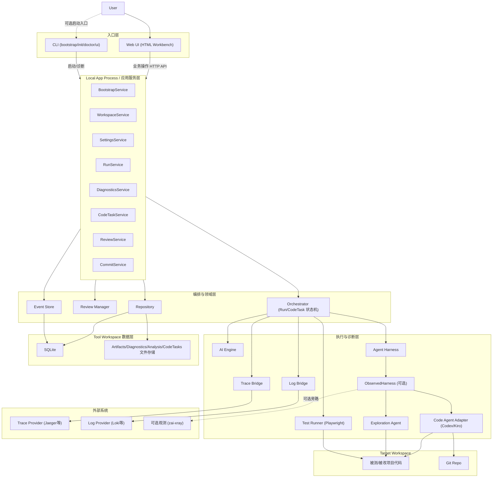
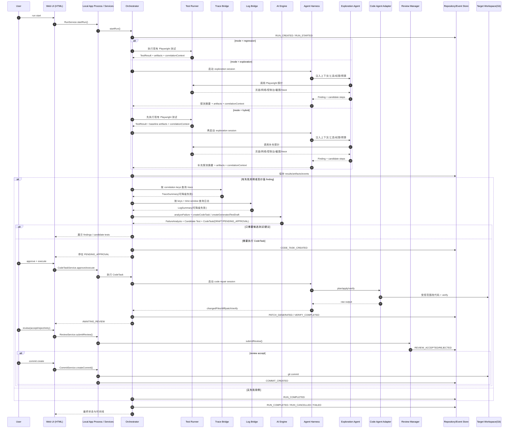
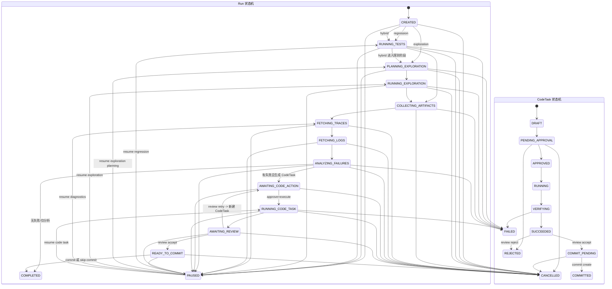

# AI 自动化回归与受控修复工作台设计文档

## 1. 文档信息

- 文档名称：AI 自动化回归与受控修复工作台设计文档
- 文档版本：v2.2
- 目标形态：本地单体部署、模块化代码结构、可中断流程、可观测、可审批、平台化可演进
- 主要用途：作为项目初始化与第一阶段实施的直接输入

### 1.1 文档导航

总设计文档负责描述项目全貌，模块级细节拆分到以下文档：

功能设计文档（当前活跃设计，spec 阶段）：

- [项目与站点管理设计](./project-site-design.md)
- [探索模块设计](./exploration-design.md)
- [CodeTask 自动化设计](./codetask-automation-design.md)

模块设计文档：

- [Orchestrator 详细设计](./orchestrator-design.md)
- [Diagnostics 详细设计](./diagnostics-design.md)
- [AI Engine 详细设计](./ai-engine-design.md)
- [Agent Harness 详细设计](./agent-harness-design.md)
- [CodeTask 与 Review 详细设计](./code-task-design.md)
- [HTTP API 契约设计](./api-contract-design.md)
- [Local UI 详细设计](./local-ui-design.md)
- [本地工具打包与分发设计](./packaging-design.md)
- [Test Assets 详细设计](./test-assets-design.md)
- [外部观测集成设计](./observability-design.md)
- [应用服务与访问方式设计](./app-services-design.md)
- [存储映射设计（字段级）](./storage-mapping-design.md)

外部参考文档：

- [OpenAI Codex CLI 官方文档](https://developers.openai.com/codex/cli)
- [Kiro CLI 官方文档](https://kiro.dev/docs/cli/)

---

## 2. 项目定位

### 2.1 背景

当前希望基于 Playwright 构建一个本地可运行的 AI 自动化测试工作台，用于本地环境或开发环境下的回归测试，并在失败后进入受控修复流程。

系统需要能够：

1. 执行已有 Playwright 测试集。
2. 采集执行产物并提取诊断关联键。
3. 联动 trace 与日志系统辅助定位后端问题。
4. 使用 AI 对失败进行归因分析，并支持 AI 辅助自主探测站点问题。
5. 将高价值发现沉淀为候选测试用例、修复任务草稿或人工调查建议。
6. 面向用户配置的目标项目目录执行测试和代码修改。
7. 生成并执行受控代码修复任务。
8. 支持人工 review、人工确认提交。
9. 整个流程可暂停、可恢复、可取消、可审计。

### 2.2 本阶段目标

本阶段要交付的不是“纯测试工作台”，也不是“全自动自愈平台”，而是一个：

- 本地单机可运行
- 可稳定执行回归测试
- 可产出可追踪失败报告
- 可关联 trace 和日志定位问题
- 可面向指定本地项目目录工作
- 可生成并执行受控代码修复任务
- 可让用户在关键节点审批、review、提交
- 可逐步升级为平台化系统的骨架

### 2.3 非目标

当前阶段不做以下内容：

- 多租户能力
- 在线 SaaS 化
- 分布式调度
- 无人工 review 的自动提交主分支
- 开放式、不可约束的复杂多 agent 自主协作系统
- 自动上线与发布审批流

---

## 3. 核心设计原则

### 3.1 Local-First

第一阶段优先本地运行体验，单机即可启动、执行、调试、review 和提交。

### 3.2 Human-in-the-Loop

分析可以自动推进，代码修改和提交必须受控，关键节点必须允许用户介入。

### 3.3 Interruptible by Design

流程必须支持暂停、恢复、取消、重试，且不能依赖进程内状态。

### 3.4 Observable by Default

所有关键步骤都要落事件、落状态、落产物，当前由 UI 基于同一套状态与事件展示，CLI 保留扩展入口。

### 3.5 Platform-Ready

虽然当前是本地单体，但模块边界和接口抽象要为未来服务化拆分预留空间。

### 3.6 Asset and Audit First

测试资产、执行结果、AI 建议、代码修改记录、review 记录、commit 记录都必须持久化，可追溯。

### 3.7 Diagnostics First

trace、日志、network、screenshot、verify 输出应被视为一等诊断输入，而不是附属产物。

---

## 4. 最小完整闭环

本项目优先打通的最小完整闭环为：

```text
Playwright 回归执行 / AI 引导探测
  -> artifacts 落地
  -> 诊断关联键提取
  -> trace 查询
  -> 日志查询
  -> AI 失败分析
  -> 候选测试 / CodeTask 草稿
  -> 报告展示
  -> 用户审批
  -> Agent Harness 执行受控变更
  -> verify
  -> 人工 review
  -> 人工确认提交
```

约束：

- `AI 分析` 可自动执行。
- `CodeTask 执行` 默认停在待审批状态。
- `Commit` 必须是独立动作，不与 review 自动绑定。

---

## 5. 系统总体架构

### 5.1 架构概览

本地版本整体采用“单体进程 + 模块化分层 + 持久化状态机”的结构。

核心模块包括：

1. CLI：本地启动/初始化/诊断入口（不承载当前业务操作流）
2. Orchestrator：状态推进与任务编排
3. Test Runner：Playwright 执行器（既跑现有测试，也执行探测探针）
4. Trace Bridge：链路查询桥接
5. Log Bridge：日志查询桥接
6. AI Engine：失败分析、发现归纳、候选测试/修复任务草稿生成
7. Agent Harness：Agent 运行时外壳，负责上下文、工具、权限、审批、恢复、回放
8. Exploration Agent：AI 自主探测站点问题的专用 Agent
9. Code Agent Adapter：受控代码修改执行层
10. Review Manager：review 与提交控制
11. Local Web UI：本地可视化界面
12. Storage：SQLite 与本地文件存储
13. Event Store：事件记录与时间线能力
14. Settings Manager：个人配置校验、持久化与即时生效

模块细节跳转：

- 状态推进与中断恢复见 [orchestrator-design.md](./orchestrator-design.md)
- trace / 日志 / 关联键见 [diagnostics-design.md](./diagnostics-design.md)
- AI 分析与 CodeTask draft 见 [ai-engine-design.md](./ai-engine-design.md)
- Agent 运行时与权限边界见 [agent-harness-design.md](./agent-harness-design.md)
- CodeTask / review / commit 见 [code-task-design.md](./code-task-design.md)
- 本地前端控制台见 [local-ui-design.md](./local-ui-design.md)
- HTTP API 约定见 [api-contract-design.md](./api-contract-design.md)
- 本地工具交付形态见 [packaging-design.md](./packaging-design.md)
- 测试资产与共享目录见 [test-assets-design.md](./test-assets-design.md)
- 外部观测旁路集成见 [observability-design.md](./observability-design.md)
- 应用服务边界见 [app-services-design.md](./app-services-design.md)

架构图（Mermaid）：



### 5.2 高层执行链路

```text
Web UI（HTML 页面）发起 Run
  ->
Orchestrator 创建 Run
  ->
按 `regression / exploration / hybrid` 归一化执行计划
  ->
Test Runner 执行 Playwright 回归 / 探针
  ->
保存 artifacts / network / correlation context
  ->
Trace Bridge 查询 TraceSummary
  ->
Log Bridge 查询 LogSummary
  ->
AI Engine 生成 FailureAnalysis / Finding / Candidate Test / CodeTask Draft
  ->
需要变更时创建 CodeTask（默认 PENDING_APPROVAL）
  ->
用户决定 approve / reject / skip / cancel
  ->
Agent Harness 托管 Exploration Agent / Code Agent 执行
  ->
用户 review diff / patch / verify 输出
  ->
用户决定 accept / reject / retry（verify 失败时可走受控 override accept）
  ->
用户决定是否提交
```

时序图（Mermaid）：



### 5.3 架构分层

```text
+---------------------------------------------------------------+
| Web UI (主操作面) / CLI(可选启动入口)                         |
+---------------------------------------------------------------+
| Orchestrator / Review Manager / Event Store                   |
+---------------------------------------------------------------+
| Test Runner | Trace Bridge | Log Bridge | AI Engine           |
+---------------------------------------------------------------+
| Agent Harness | Exploration Agent | Code Agent Adapter        |
+---------------------------------------------------------------+
| Config | Storage | Shared Types | API Contract                |
+---------------------------------------------------------------+
| Playwright | Trace API | Log API | SQLite | Local File System |
+---------------------------------------------------------------+
```

### 5.4 设计架构说明

- CLI 与 UI 只调用控制层，不直接耦合底层实现。
- Orchestrator 负责状态机推进，不承载 provider 细节。
- 诊断层由 `Test Runner + Trace Bridge + Log Bridge` 共同组成。
- Test Runner 统一承接现有测试执行与 AI 规划后的 Playwright 探针执行，保证执行侧可复现。
- AI Engine 只负责分析、发现归纳和草稿生成，不直接持有运行时工具权限。
- Agent Harness 是所有 Agent 的统一运行时外壳，负责上下文拼装、工具注册、权限边界、审批门禁、重试恢复、checkpoint、trace 与 replay。
- Exploration Agent 负责“看哪里、探哪里、停在哪里”的决策，不直接绕开 Harness 调工具。
- Code Agent Adapter 负责通过 Harness 执行受控代码修改，并以工作区 diff/patch/verify 为准落盘产物。
- Event Store 贯穿全链路，是可观测性与恢复能力的基础。
- 外部观测工具只允许旁路接入，不作为主流程依赖。

当前访问方式约束：

- Web UI 作为当前唯一业务操作与查看入口
- 所有 run/diagnostics/code-task/review/commit/settings 操作统一走 HTML 页面
- CLI 仅保留 `bootstrap/init/doctor/ui` 能力，作为可选本地入口
- Local App Process 作为本地应用服务宿主
- Web UI 通过 localhost API 调用应用服务

### 5.5 部署形态

本阶段部署形态：

- 单仓库
- 本地 Node.js 进程
- 本地 SQLite
- 本地文件存储
- 本地 UI

未来平台化演进方向：

- Orchestrator 拆分为调度服务
- Runner 拆为独立 worker
- Trace / Log Bridge 拆为集成服务
- Code Agent 执行器拆为隔离 worker
- SQLite 替换为 PostgreSQL
- 本地文件替换为对象存储
- Local UI 升级为平台 Web Console

---

## 6. 项目结构设计

### 6.1 建议仓库结构

```text
ai-regression-workbench/
  apps/
    cli/
      src/
    orchestrator/
      src/
    test-runner/
      src/
    trace-bridge/
      src/
    log-bridge/
      src/
    ai-engine/
      src/
    review-manager/
      src/
    local-ui/
      src/
  packages/
    agent-harness/
      src/
    shared-types/
      src/
    shared-utils/
      src/
    config/
      src/
    storage/
      src/
    event-store/
      src/
    logger/
      src/
    test-assets/
      tests/
      pages/
      fixtures/
      data/
      helpers/
  .zarb/
    config.local.yaml
    data/
      sqlite/
      runs/
      artifacts/
      diagnostics/
      analysis/
      code-tasks/
      commits/
      generated-tests/
  docs/
  scripts/
  package.json
  pnpm-workspace.yaml
  playwright.config.ts
  tsconfig.base.json
```

### 6.2 目录职责

- `apps/cli`
  命令入口、终端输出、watch、控制动作。

- `apps/orchestrator`
  状态推进、任务调度、暂停恢复、统一错误处理。
  详见 [orchestrator-design.md](./orchestrator-design.md)

- `apps/test-runner`
  Playwright 执行、network capture、correlation context 提取。

- `apps/trace-bridge`
  Trace provider 适配和 `TraceSummary` 归一化。

- `apps/log-bridge`
  Log provider 适配和 `LogSummary` 归一化。
  详见 [diagnostics-design.md](./diagnostics-design.md)

- `apps/ai-engine`
  `FailureAnalysis`、`CodeTask` draft、agent 路由策略。
  详见 [ai-engine-design.md](./ai-engine-design.md)

- `packages/agent-harness`
  Agent runtime、tool registry、policy、checkpoint、replay、`ExplorationAgent` / `CodeAgent` 装配。
  详见 [agent-harness-design.md](./agent-harness-design.md)

- `apps/review-manager`
  Review、commit、审计记录。
  详见 [code-task-design.md](./code-task-design.md)

- `apps/local-ui`
  Run、diagnostics、code task、review、settings 视图。
  详见 [local-ui-design.md](./local-ui-design.md)

- `packages/shared-types`
  DTO、状态枚举、接口定义。

- `packages/config`
  YAML + env 配置加载、默认值、校验、配置热更新广播。

- `packages/storage`
  SQLite repository、本地 artifact store。

- `packages/event-store`
  事件写入、查询、时间线聚合。

- `packages/logger`
  Pino 等结构化日志封装。

- `packages/test-assets`
  测试资产、page object、fixtures、测试数据。
  详见 [test-assets-design.md](./test-assets-design.md)

### 6.3 模块依赖约束

- `apps/*` 可以依赖 `packages/*`。
- `packages/*` 不依赖 `apps/*`。
- `apps/orchestrator` 不直接依赖具体 provider 的实现细节，只依赖接口。
- `apps/local-ui` 不直连 SQLite，统一通过 API 或读取统一 repository 接口。
- `ExplorationAgent` 与 `CodeAgent` 的运行时归属 `packages/agent-harness`，`apps/ai-engine` 只负责分析与 draft 生成。

### 6.4 目标项目目录约束

系统自身仓库与被测试、被修改的目标项目目录不一定相同。

因此必须引入可配置的目标工作区概念：

- `tool workspace`
  `ai-regression-workbench` 自身运行和存储数据的目录。

- `target workspace`
  被测试、被分析、被 code agent 修改的业务工程目录。

设计要求：

- 所有 Playwright 执行、代码搜索、代码修改、git 操作都必须基于 `target workspace`
- 所有运行数据、diagnostics、analysis、code-task 产物默认保存在 `tool workspace` 下
- UI 必须能展示当前生效的 `target workspace`
- 当前阶段通过 UI 设置显式配置 `target workspace`（CLI 覆盖参数为后续扩展）

---

## 7. 核心领域模型

本项目的主轴不再只有 `TestRun`，而是以下核心对象。

### 7.1 Run

表示一次执行任务，可以是现有测试回归、AI 自主探测，或两者混合。

职责：

- 记录执行入口和范围
- 维护整体状态
- 记录 `mode`、当前阶段、暂停与超时信息
- 关联 test results、diagnostics、analysis、code tasks、events

### 7.2 TestResult

表示某个 testcase 在某次 run 中的执行结果。

职责：

- 记录原始失败信息
- 关联 artifacts 与 diagnostics

### 7.2.1 Scenario

表示一个可复用的业务场景定义，是 testcase 和 exploration finding 的稳定业务锚点。

职责：

- 作为 testcase 的业务语义分组
- 承接 AI 探测发现与候选测试沉淀
- 支持从候选测试晋升为正式测试

关系：

- 一个 `Scenario` 可以关联多个 `TestCase`

### 7.3 CorrelationContext

表示从网络响应和执行上下文中提取的诊断关联键。

职责：

- 为 trace 查询与日志查询提供统一输入

### 7.4 FailureAnalysis

表示一次针对失败 testcase 的 AI 归因分析。

职责：

- 对失败原因进行结构化归类
- 产出修复建议
- 为后续 CodeTask 提供输入

说明：

- `FailureAnalysis` 只负责建议，不直接改代码。
- 一次 `FailureAnalysis` 可派生多个 `CodeTask` 或候选测试草稿。

### 7.4.1 AgentSession

表示一次由 Harness 托管的 Agent 会话，既可用于 exploration，也可用于 code repair。

职责：

- 记录探测预算、工具调用、checkpoint、终止原因
- 作为 `exploration` / `hybrid` run 或 code repair 的审计锚点
- 为 finding、candidate test、replay 提供索引

### 7.4.2 Finding

表示一次 exploration session 产生的问题发现。

职责：

- 记录 exploration 问题类别、严重级别、证据与页面位置
- 支持转为候选测试、CodeTask 或人工调查事项
- 作为探索结果与后续修复之间的桥梁
- 同一 exploration session 可以产生多个 finding

说明：

- `Finding` 是 exploration session 的结构化输出
- regression 失败分析产出 `FailureAnalysis`，不直接落为 `findings` 表

### 7.5 CodeTask

表示一次受控代码修改任务。

职责：

- 定义目标、范围、约束、执行 agent
- 绑定执行 attempt、parent task 与 Harness session
- 承载修改产物与验证结果
- 作为 review 和 commit 的基础对象

说明：

- 同一次分析允许产生多个 `CodeTask`
- retry 必须创建新 `CodeTask`，通过 `parentTaskId` 串联历史

### 7.6 Review

表示一次人工审查动作。

职责：

- 审查 diff / patch / verify 输出
- 绑定被审查 diff/patch 的 hash 快照
- 决定接受、驳回、重试或仅保留结果

### 7.7 CommitRecord

表示一次提交动作。

职责：

- 记录 branch、commit sha、message
- 记录是否已正式提交、失败原因与 override 背景

### 7.7.1 SystemEvent

表示与具体 run 无关的系统级事件。

职责：

- 记录 settings 更新、初始化、迁移等全局动作
- 避免把非 run 事件混入 `run_events`

### 7.8 RunEvent

表示状态推进中的一个事件。

职责：

- 为 UI 提供时间线（CLI 可后续扩展）
- 为恢复与排错提供依据

### 7.9 ApiCallRecord

表示一次接口调用记录（接口粒度）。

职责：

- 记录请求/响应核心信息与耗时
- 记录是否成功、错误类型与降级信息
- 关联 `traceId / requestId / testcaseId / flowStepId / uiActionId`

### 7.10 UiActionRecord

表示一次 UI 交互动作记录（点击事件粒度）。

职责：

- 记录动作类型（click/input/select 等）、定位器与页面位置
- 记录动作开始/结束时间与执行结果
- 统计该动作触发的接口数量与失败数量

### 7.11 FlowStepRecord

表示某条业务流程中的步骤记录（流程链路粒度）。

职责：

- 记录步骤名称、开始/结束时间、耗时
- 聚合步骤内 `uiActionCount / apiCallCount / failedApiCount`
- 作为执行报告的流程链路明细输入

---

## 8. 状态机设计

### 8.1 RunStatus

```text
CREATED
-> RUNNING_TESTS / PLANNING_EXPLORATION / RUNNING_EXPLORATION
-> COLLECTING_ARTIFACTS
-> FETCHING_TRACES
-> FETCHING_LOGS
-> ANALYZING_FAILURES
-> AWAITING_CODE_ACTION
-> RUNNING_CODE_TASK
-> AWAITING_REVIEW
-> READY_TO_COMMIT
-> COMPLETED
```

异常状态：

- `PAUSED`
- `FAILED`
- `CANCELLED`

说明：

- 没有失败用例时，`ANALYZING_FAILURES` 后可直接进入 `COMPLETED`。
- 若用户选择只分析不修复，则 `AWAITING_CODE_ACTION` 后可直接进入 `COMPLETED`。
- trace/log 查询失败不应直接导致 run 失败，应记录降级事件并继续。
- `PAUSED` 表示当前步骤已在安全点停下，可由用户显式恢复。
- `regression` 模式通常直接进入 `RUNNING_TESTS`。
- `exploration` 模式可直接进入 `PLANNING_EXPLORATION`，由 Harness 生成 probe plan。
- `hybrid` 模式必须先进入 `RUNNING_TESTS`，再进入 `PLANNING_EXPLORATION` 做补充探测。
- `resume` 的目标状态由系统根据最近 checkpoint 与 `currentStage` 自动决定，而不是由接口调用方指定。
- 多 CodeTask 并行时，Run 状态是聚合视图；状态机图中的迁移表示“可能的聚合结果”，不表示单个 CodeTask retry 会强制回退所有其他 CodeTask。

### 8.2 CodeTaskStatus

```text
DRAFT
-> PENDING_APPROVAL
-> APPROVED
-> RUNNING
-> VERIFYING
-> SUCCEEDED
-> COMMIT_PENDING
-> COMMITTED
```

异常状态：

- `FAILED`
- `REJECTED`
- `CANCELLED`

说明：

- `SUCCEEDED` 表示 apply/verify 阶段成功结束，但 CodeTask 仍需等待人工 review；它不是整个 CodeTask 流程的终态

状态机图（Mermaid）：



补充说明：

- `COLLECTING_ARTIFACTS` 在 `regression / hybrid` 的测试阶段主要汇总 screenshot、video、trace、network、html report 等执行产物
- `COLLECTING_ARTIFACTS` 在 `exploration` 阶段主要汇总 harness session trace、finding 摘要、candidate steps 与相关截图引用

### 8.3 控制动作

系统必须支持以下控制动作：

- `pause`：当前步骤结束后暂停，不进入下一步
- `resume`：从最近稳定状态继续
- `cancel`：取消尚未执行的后续流程
- `retry-analysis`：基于原始失败证据重新分析
- `retry-code-task`：基于旧任务创建新的修复任务 attempt
- `reject`：否决某个 CodeTask
- `approve`：批准某个 CodeTask 可以执行

### 8.4 设计要求

- 状态推进必须持久化，不依赖单个进程内存。
- 每一步推进都必须记录事件。
- 所有可中断节点都必须可恢复。
- `pause` 采用“安全点暂停”模型，由 UI 基于 `PAUSED + currentStage` 展示。
- CodeTask 的 review retry 不回退原任务状态，必须生成带 `parentTaskId` 的新任务。
- 关键步骤必须定义超时策略并可配置：
  - AI 分析默认 60s
  - exploration session 默认总预算 10min，单步工具调用 30s
  - code agent `plan/apply/verify` 默认 60s / 10min / 每命令 5min
  - 审批与 review 默认不自动过期，但超过阈值要标记 `stale`

---

## 9. 可观测性与事件流

### 9.1 设计目标

系统的可观测性依赖以下三层：

1. 结构化运行日志
2. 持久化状态
3. 统一事件流

当前由 Web UI 基于状态表与事件表展示实时进度；CLI 仅保留未来扩展能力。

### 9.2 事件模型

建议定义统一事件，分为 `run events` 与 `system events` 两类。

`run events`：

- `RUN_CREATED`
- `RUN_STARTED`
- `RUN_PAUSED`
- `RUN_RESUMED`
- `TESTCASE_PASSED`
- `TESTCASE_FAILED`
- `EXPLORATION_SESSION_STARTED`
- `EXPLORATION_STEP_COMPLETED`
- `FINDING_RECORDED`
- `ARTIFACT_SAVED`
- `CORRELATION_CONTEXT_CAPTURED`
- `UI_ACTION_CAPTURED`
- `API_CALL_CAPTURED`
- `FLOW_STEP_COMPLETED`
- `TRACE_FETCH_SUCCEEDED`
- `TRACE_FETCH_FAILED`
- `LOG_FETCH_SUCCEEDED`
- `LOG_FETCH_FAILED`
- `AI_ANALYSIS_COMPLETED`
- `AI_ANALYSIS_FAILED`
- `CODE_TASK_CREATED`
- `CODE_TASK_APPROVED`
- `CODE_TASK_REJECTED`
- `CODE_TASK_STARTED`
- `PATCH_GENERATED`
- `VERIFY_COMPLETED`
- `REVIEW_ACCEPTED`
- `REVIEW_REJECTED`
- `COMMIT_CREATED`
- `RUN_STEP_DEGRADED`
- `EXECUTION_PROFILE_UPDATED`
- `EXECUTION_REPORT_CREATED`
- `RUN_COMPLETED`
- `RUN_CANCELLED`

`system events`：

- `SETTINGS_VALIDATED`
- `SETTINGS_UPDATED`
- `SETTINGS_APPLIED`
- `BOOTSTRAP_COMPLETED`
- `MIGRATION_APPLIED`
- `HARNESS_POLICY_UPDATED`

### 9.3 Event Store

建议新增统一事件能力，至少包含 `run_events` 与 `system_events` 两张表，支持：

- 时间线展示
- Web UI 实时刷新
- CLI watch（未来扩展）
- 调试与审计
- 恢复执行

事件读取接口建议：

- `GET /runs/:runId/events?cursor=<eventId>&limit=<n>`：增量拉取
- 返回结构建议：`items[] + nextCursor`
- 第一阶段以轮询为主，SSE 暂不作为默认依赖
- 可选 `GET /runs/:runId/events/stream`（SSE）作为后续低延迟增强

事件 payload 设计要求：

- 所有 payload 必须包含 `schemaVersion`
- `event_type` 决定 payload schema，不允许同名事件混用不同结构
- 至少为高频事件定义标准结构：
  - `TESTCASE_FAILED`：`testcaseId/errorType/errorMessage/artifactRefs`
  - `CODE_TASK_CREATED`：`taskId/analysisId/target/automationLevel/scopePaths`
  - `REVIEW_ACCEPTED`：`taskId/reviewId/diffHash/patchHash`
  - `EXPLORATION_STEP_COMPLETED`：`sessionId/stepIndex/pageUrl/toolName/outcome`

### 9.4 结构化日志要求

关键阶段必须打印结构化日志：

- run 创建
- runner 开始/结束
- testcase 失败
- UI action 统计（总动作数、失败动作数）
- API 调用统计（总调用数、失败数、P95 耗时）
- correlation context 提取结果
- trace 查询结果
- 日志查询结果
- AI 分析结果
- exploration session 预算消耗、停止原因、finding 数量
- Harness session 创建/恢复/审批/策略拒绝
- code task 审批/执行/验证
- review / commit 决策
- settings 校验/保存/生效结果
- SQLite 写队列、迁移执行、关键查询耗时

---

## 10. 模块设计

### 10.1 CLI

职责：

- 提供本地启动入口
- 承担初始化与诊断（`init` / `doctor`）
- 启动 HTML 工作台（`zarb` / `zarb ui`）
- 保留未来脚本化扩展能力（当前不承载业务操作流）

### 10.2 Orchestrator

职责：

- 维护 Run 与 CodeTask 状态机
- 驱动模块协作
- 执行自动推进
- 在待审批节点停下

要求：

- 不直接依赖 Playwright 细节
- 不直接写死某个 code agent CLI

### 10.3 Test Runner

职责：

- 执行 Playwright 测试与探针
- 输出 trace、screenshot、video、network log
- 提取诊断关联键
- 采集接口调用记录、点击动作记录、流程步骤记录

支持粒度：

- suite
- scenario
- tag
- testcase
- probe plan

第一阶段选择约束：

- `regression` 模式必须携带一个主选择器（`suite | scenario | tag | testcase`）
- `exploration` 模式必须携带 exploration 配置，且不要求 selector
- `hybrid` 模式必须先给出 regression selector，之后按 exploration 配置继续探测
- 若未传入 regression selector，由 Web UI 在入参归一化阶段补全默认值（建议默认 `suite=smoke`）

### 10.4 Trace Bridge

职责：

- 根据 traceId 查询后端追踪系统
- 将原始结果转成统一 `TraceSummary`

### 10.5 Log Bridge

职责：

- 根据诊断关联键与时间窗口查询日志系统
- 将结果归一化为 `LogSummary`

### 10.6 AI Engine

职责：

- 失败归因分析
- finding 归纳与优先级排序
- 生成修复建议
- 生成候选测试草稿
- 生成 CodeTask 草稿

说明：

- AI 输出默认只到 `CodeTask:DRAFT` 或 `PENDING_APPROVAL`
- AI 提示词模板、上下文裁剪和 provider 差异适配由 `AI Engine` 自身负责

### 10.7 Agent Harness

职责：

- 统一托管 Agent session 生命周期
- 拼装上下文、注册工具、应用权限策略与审批门禁
- 负责重试、checkpoint、错误恢复、trace、回放与 eval 入口
- 记录 tool call、session 状态、预算消耗与人工确认记录

说明：

- Harness 是 Agent 的运行时外壳，不替代业务流程状态机
- 所有具备工具权限的 Agent 都必须通过 Harness 运行

### 10.8 Exploration Agent

职责：

- 基于 run 上下文决定下一步探测目标
- 调用 Harness 注册的 Playwright 工具执行探针
- 产出 finding、候选步骤、候选测试线索

说明：

- Exploration Agent 不直接写业务代码
- Exploration Agent 不绕过 Harness 直接调用文件系统、shell 或 git

### 10.9 Code Agent Adapter

职责：

- 调用 Codex CLI / Kiro CLI 等 agent
- 执行受控范围内的代码修改
- 落地 raw output / diff / patch / verify 输出

执行模型：

- `CodexCliAgent`
  作为 `headless automation agent` 使用，适合自动编排执行

- `KiroCliAgent`
  作为 `interactive assisted agent` 使用，适合用户接管的交互式修复会话

参考：

- [OpenAI Codex CLI 官方文档](https://developers.openai.com/codex/cli)
- [Kiro CLI 官方文档](https://kiro.dev/docs/cli/)

### 10.10 Review Manager

职责：

- 记录人工 review 决策
- 控制是否允许进入提交阶段

### 10.11 Local Web UI

职责：

- 展示 run 列表与详情
- 展示 testcase、diagnostics、analysis、code task
- 展示事件时间线
- 提供 approve、execute、review、commit、settings 控制入口

### 10.12 ConfigManager / SettingsService

职责：

- 读取并校验 `config.local.yaml`
- 对外提供 `getSettings/validateSettings/updateSettings`
- 保存配置后通过观察者接口向 trace/log/diagnostics/ai/harness/codeAgent 广播最新快照
- 维护配置版本号，避免并发覆盖
- 敏感配置优先从环境变量解析，避免明文落盘

约束：

- 观察者接口建议统一为 `onConfigUpdated(snapshot: SettingsSnapshot): Promise<void>`
- 默认由 `BootstrapService.bootstrap()` 在模块装配阶段统一注册观察者
- 懒加载模块在初始化时必须先同步拉取当前 `SettingsSnapshot`，再注册后续更新订阅

---

## 11. 核心接口抽象

### 11.0 RunRequest

```ts
export type RunMode = 'regression' | 'exploration' | 'hybrid';
export type RunScopeType = 'suite' | 'scenario' | 'tag' | 'testcase' | 'exploration';

export interface RunSelector {
  suite?: string;
  scenarioId?: string;
  tag?: string;
  testcaseId?: string;
}

export interface ExplorationConfig {
  startUrls: string[];
  allowedHosts?: string[];
  maxSteps: number;
  maxPages: number;
  focusAreas?: Array<'smoke' | 'navigation' | 'forms' | 'console-errors' | 'network-errors' | 'auth'>;
  persistAsCandidateTests?: boolean;
}

export interface RunRequest {
  runMode: RunMode;
  selector?: RunSelector;
  exploration?: ExplorationConfig;
  projectPath?: string;
  includeSharedInRuns?: boolean;
  includeGeneratedInRuns?: boolean;
}
```

实现要求：

- `regression` 模式下 `selector` 四个字段必须且只能有一个有效值
- `exploration` 模式下必须提供 `exploration`
- `hybrid` 模式下必须同时提供 `selector + exploration`
- 实现层必须在启动前做参数校验，并将校验结果写入事件
- `RunRequest.exploration` 的最终值按 `StartRunInput.exploration > PersonalSettings.exploration > config.default.yaml` 合并
- 合并后的完整配置必须写入 `test_runs.exploration_config_json`

### 11.0.1 Settings Contract

```ts
export interface SettingsSnapshot {
  version: number;
  sourcePath: string;
  updatedAt: string;
  values: Record<string, unknown>;
}

export interface UpdateSettingsInput {
  patch: Record<string, unknown>;
  expectedVersion?: number;
}

export interface SettingsApplyResult {
  success: boolean;
  message: string;
  errorCode?: string;
  version?: number;
  reloadedModules?: string[];
  nextRunOnlyKeys?: string[];
  requiresRestart?: boolean;
  warnings?: string[];
}
```

实现要求：

- `updateSettings` 成功时必须完成“保存 + 生效”双步骤
- 失败时必须回滚到旧快照并返回失败字段
- 生效结果必须返回 `reloadedModules/nextRunOnlyKeys`
- `report.port` 等需要重启的配置必须通过 `requiresRestart=true` 明示，而不是运行时热重绑

### 11.1 TestRunner

```ts
export interface TestRunner {
  run(request: RunRequest): Promise<RunResult>;
}
```

### 11.2 CorrelationContext

```ts
export interface CorrelationContext {
  traceIds: string[];
  requestIds: string[];
  sessionIds: string[];
  serviceHints?: string[];
  fromTime?: string;
  toTime?: string;
}
```

### 11.2.1 ExecutionTelemetry

```ts
export interface ApiCallRecord {
  id: string;
  runId: string;
  testcaseId: string;
  flowStepId?: string;
  uiActionId?: string;
  method?: string;
  url: string;
  statusCode?: number;
  responseSummary?: string;
  success: boolean;
  errorType?: string;
  errorMessage?: string;
  traceId?: string;
  requestId?: string;
  startedAt: string;
  endedAt?: string;
  durationMs?: number;
}

export interface UiActionRecord {
  id: string;
  runId: string;
  testcaseId: string;
  flowStepId?: string;
  actionType: 'click' | 'input' | 'select' | 'assert' | 'wait' | 'other';
  locator?: string;
  pageUrl?: string;
  success: boolean;
  startedAt: string;
  endedAt?: string;
  durationMs?: number;
  apiCallCount?: number;
  failedApiCount?: number;
}

export interface FlowStepRecord {
  id: string;
  runId: string;
  testcaseId: string;
  flowId: string;
  stepName: string;
  success: boolean;
  startedAt: string;
  endedAt?: string;
  durationMs?: number;
  uiActionCount?: number;
  apiCallCount?: number;
  failedApiCount?: number;
}
```

### 11.3 TraceProvider

```ts
export interface TraceProvider {
  getTrace(traceId: string): Promise<TraceSummary | null>;
}
```

### 11.4 LogProvider

```ts
export interface LogQuery {
  traceIds?: string[];
  requestIds?: string[];
  sessionIds?: string[];
  services?: string[];
  fromTime: string;
  toTime: string;
  keywords?: string[];
  limit?: number;
}

export interface LogSummary {
  matched: boolean;
  source?: string;
  totalHits?: number;
  highlights: string[];
  errorSamples: Array<{
    timestamp: string;
    level?: string;
    service?: string;
    message: string;
  }>;
  rawLink?: string;
}

export interface LogProvider {
  query(input: LogQuery): Promise<LogSummary | null>;
}
```

### 11.5 AIEngine

```ts
export interface FailureContext {
  run: Run;
  result: TestResult;
  correlationContext: CorrelationContext;
  traceSummaries: TraceSummary[];
  logSummary?: LogSummary | null;
  networkSummary?: NetworkSummary;
  screenshotPath?: string;
}

export interface AIEngine {
  analyzeFailure(input: FailureContext): Promise<FailureAnalysis>;
  createCodeTask(input: CodeTaskDraftInput): Promise<CodeTaskDraft[]>;
  createGeneratedTestDraft(input: FailureContext | ExplorationFindingContext): Promise<GeneratedTestDraft[]>;
}
```

### 11.6 Agent Harness

```ts
export interface HarnessPolicy {
  sessionBudgetMs?: number;
  toolCallTimeoutMs?: number;
  stopConditions?: {
    maxFindings?: number;
    stopWhenFocusAreasCovered?: boolean;
    stopWhenNoNewFindingsForSteps?: number;
  };
  allowedWriteScopes?: string[];
  allowedHosts?: string[];
  requireApprovalFor?: Array<'shell' | 'git-write' | 'fs-write' | 'external-http' | 'business-code-write'>;
}

export interface AgentSession {
  sessionId: string;
  runId: string;
  taskId?: string;
  agentName: string;
  kind: 'exploration' | 'code-repair';
  status: 'created' | 'running' | 'paused' | 'waiting-approval' | 'completed' | 'failed' | 'cancelled';
  policyJson?: string;
  contextRefsJson?: string;
  checkpointId?: string;
  tracePath?: string;
  startedAt: string;
  endedAt?: string;
  summary?: string;
}

export interface StartAgentSessionInput {
  agentName: string;
  kind: 'exploration' | 'code-repair';
  runId: string;
  taskId?: string;
  policy: HarnessPolicy;
  contextRefs: string[];
}

export interface AgentHarness {
  startSession(input: StartAgentSessionInput): Promise<AgentSession>;
  resumeSession(sessionId: string): Promise<void>;
  pauseSession(sessionId: string): Promise<void>;
  cancelSession(sessionId: string): Promise<void>;
  checkpoint(sessionId: string): Promise<string>;
}
```

### 11.7 ExplorationAgent

```ts
export interface ExplorationFindingContext {
  run: Run;
  session: AgentSession;
  findings: Finding[];
}

export interface ExplorationAgent {
  name: string;
  isAvailable(): Promise<boolean>;
  explore(request: RunRequest, session: AgentSession): Promise<Finding[]>;
}
```

补充约束：

- `PLANNING_EXPLORATION` 负责归一化预算、focus areas、回归失败线索并生成首轮 probe plan
- `hybrid` 模式下，planning 必须优先参考 regression 失败结果、未覆盖路径与高风险区域
- `ExplorationAgent` 的停止先受硬预算约束，再结合 `stopConditions`
- `explore()` 是 session 级入口，不表示 Agent 脱离 Harness 独立运行；实际 step 循环、tool 调用、checkpoint 与预算控制仍由 Harness 驱动

### 11.8 CodeAgent

```ts
export interface CodeTask {
  taskId: string;
  parentTaskId?: string;
  attempt: number;
  mode: 'suggest' | 'apply' | 'verify';
  target: 'test' | 'app' | 'mixed';
  automationLevel: 'headless' | 'interactive';
  workspacePath: string;
  scopePaths: string[];
  goal: string;
  contextFiles?: string[];
  diagnostics?: string[];
  constraints?: string[];
  verificationCommands?: string[];
  branchName?: string;
}

export interface CodeChangeResult {
  success: boolean;
  summary: string;
  changedFiles: string[];
  diffBaseRef?: string;
  diffPath?: string;
  patchPath?: string;
  verification?: {
    passed: boolean;
    outputs: string[];
    overrideAllowed?: boolean;
  };
  rawOutputPath?: string;
}

export interface CodeAgent {
  name: string;
  isAvailable(): Promise<boolean>;
  plan(task: CodeTask): Promise<string>;
  apply(task: CodeTask): Promise<CodeChangeResult>;
  verify(task: CodeTask): Promise<CodeChangeResult>;
}
```

说明：

- `rawOutputPath` 可以由 agent runtime 直接产出
- `changedFiles`、`diffPath`、`patchPath` 必须以 Harness 基于工作区/`git diff` 计算后的结果为准，而不是 agent 自报

### 11.9 CodeTaskPolicy

```ts
export interface CodeTaskPolicy {
  check(task: CodeTask): {
    allowed: boolean;
    reason?: string;
    normalizedScope?: string[];
    requiresApproval?: boolean;
    reviewOnVerifyFailureAllowed?: boolean;
  };
}
```

### 11.10 ArtifactStore

```ts
export interface ArtifactStore {
  saveArtifact(input: SaveArtifactInput): Promise<ArtifactRef>;
  readArtifact(path: string): Promise<Buffer | string>;
}
```

### 11.11 Repository

```ts
export interface RunRepository {
  getRun(runId: string): Promise<Run | null>;
  getCodeTask(taskId: string): Promise<PersistedCodeTask | null>;
  getCodeTasksByRunId(runId: string): Promise<PersistedCodeTask[]>;
  getAgentSession(sessionId: string): Promise<AgentSession | null>;
  saveRun(run: Run): Promise<void>;
  saveResult(result: TestResult): Promise<void>;
  saveCorrelationContext(context: PersistedCorrelationContext): Promise<void>;
  saveAgentSession(session: AgentSession): Promise<void>;
  saveFinding(finding: Finding): Promise<void>;
  saveApiCall(record: ApiCallRecord): Promise<void>;
  saveUiAction(record: UiActionRecord): Promise<void>;
  saveFlowStep(record: FlowStepRecord): Promise<void>;
  saveExecutionReport(report: ExecutionReportRecord): Promise<void>;
  saveDiagnosticFetch(fetch: DiagnosticFetch): Promise<void>;
  saveAnalysis(analysis: FailureAnalysis): Promise<void>;
  saveCodeTask(task: PersistedCodeTask): Promise<void>;
  saveReview(review: Review): Promise<void>;
  saveCommit(record: CommitRecord): Promise<void>;
  saveSystemEvent(event: SystemEvent): Promise<void>;
}
```

说明：

- `RunRepository` 是共享持久化边界，`Orchestrator`、`AgentHarness`、`DiagnosticsService` 可按职责直接调用对应读写方法
- `AgentHarness` 不需要经由 `Orchestrator` 中转每一条 step 级持久化，但业务状态迁移仍由 `Orchestrator` 主导

---

## 12. 数据模型设计

### 12.1 Run

建议字段：

- `runId`
- `runMode`
- `triggerType`
- `environment`
- `scopeType`
- `scopeValue`
- `selectorJson`
- `status`
- `pauseRequested`
- `currentStage`
- `pausedAt`
- `timeoutAt`
- `startedAt`
- `endedAt`
- `total`
- `passed`
- `failed`
- `skipped`
- `summary`

### 12.2 TestResult

建议字段：

- `id`
- `runId`
- `testcaseId`
- `scenarioId`
- `status`
- `errorType`
- `errorMessage`
- `durationMs`
- `screenshotPath`
- `videoPath`
- `tracePath`
- `htmlReportPath`
- `networkLogPath`
- `createdAt`

### 12.2.1 Scenario

建议字段：

- `scenarioId`
- `name`
- `description`
- `entryUrlsJson`
- `riskTagsJson`
- `owner`
- `createdAt`
- `updatedAt`

### 12.3 CorrelationContext

建议字段：

- `id`
- `runId`
- `testcaseId`
- `traceIdsJson`
- `requestIdsJson`
- `sessionIdsJson`
- `serviceHintsJson`
- `fromTime`
- `toTime`
- `createdAt`

### 12.4 DiagnosticFetch

建议字段：

- `id`
- `runId`
- `testcaseId`
- `type`
- `status`
- `provider`
- `requestJson`
- `summaryJson`
- `rawLink`
- `createdAt`

### 12.5 FailureAnalysis

建议字段：

- `id`
- `runId`
- `testcaseId`
- `category`
- `suspectedLayer`
- `confidence`
- `summary`
- `probableCause`
- `traceSummaryJson`
- `logSummaryJson`
- `suggestionsJson`
- `version`
- `createdAt`

### 12.5.1 AgentSession

建议字段：

- `sessionId`
- `runId`
- `taskId`
- `kind`
- `agentName`
- `status`
- `policyJson`
- `contextRefsJson`
- `checkpointId`
- `tracePath`
- `startedAt`
- `endedAt`
- `summary`

### 12.5.2 Finding

建议字段：

- `id`
- `runId`
- `sessionId`
- `scenarioId`
- `category`
- `severity`
- `pageUrl`
- `title`
- `summary`
- `evidenceJson`
- `promotedTaskId`
- `createdAt`

### 12.6 CodeTask

建议字段：

- `taskId`
- `parentTaskId`
- `attempt`
  作为持久层字段；API/DTO 可暴露为 `taskVersion`，两者必须保持一一对应
- `runId`
- `testcaseId`
- `analysisId`
- `analysisVersion`
- `status`
- `agentName`
- `harnessSessionId`
- `mode`
- `target`
- `automationLevel`
- `workspacePath`
- `scopePathsJson`
- `goal`
- `constraintsJson`
- `verificationCommandsJson`
- `summary`
- `changedFilesJson`
- `diffPath`
- `patchPath`
- `rawOutputPath`
- `verifyPassed`
- `verifyOverrideUsed`
- `createdAt`
- `updatedAt`

### 12.7 Review

建议字段：

- `id`
- `taskId`
- `reviewer`
- `decision`
- `comment`
- `diffHash`
- `patchHash`
- `codeTaskVersion`
- `createdAt`

### 12.8 CommitRecord

建议字段：

- `id`
- `taskId`
- `branchName`
- `commitSha`
- `commitMessage`
- `status`
- `errorMessage`
- `createdAt`

### 12.9 RunEvent

建议字段：

- `id`
- `runId`
- `entityType`
- `entityId`
- `eventType`
- `payloadSchemaVersion`
- `payloadJson`
- `createdAt`

### 12.9.1 SystemEvent

建议字段：

- `id`
- `eventType`
- `payloadSchemaVersion`
- `payloadJson`
- `createdAt`

### 12.10 ApiCallRecord

建议字段：

- `id`
- `runId`
- `testcaseId`
- `flowStepId`
- `uiActionId`
- `method`
- `url`
- `statusCode`
- `responseSummary`
- `success`
- `errorType`
- `errorMessage`
- `traceId`
- `requestId`
- `startedAt`
- `endedAt`
- `durationMs`

### 12.11 UiActionRecord

建议字段：

- `id`
- `runId`
- `testcaseId`
- `flowStepId`
- `actionType`
- `locator`
- `pageUrl`
- `success`
- `startedAt`
- `endedAt`
- `durationMs`
- `apiCallCount`
- `failedApiCount`

### 12.12 FlowStepRecord

建议字段：

- `id`
- `runId`
- `testcaseId`
- `flowId`
- `stepName`
- `success`
- `startedAt`
- `endedAt`
- `durationMs`
- `uiActionCount`
- `apiCallCount`
- `failedApiCount`

### 12.13 ExecutionReportRecord

建议字段：

- `id`
- `runId`
- `status`
- `reportPath`
- `totalsJson`
- `generatedAt`

说明：

- `ExecutionReportRecord` 只保存索引字段
- 完整 `ExecutionReport` JSON 持久化到 `runs/<runId>-execution-report.json`

---

## 13. SQLite 表设计建议

### 13.1 test_runs

```sql
CREATE TABLE test_runs (
  run_id TEXT PRIMARY KEY,
  run_mode TEXT NOT NULL,
  trigger_type TEXT,
  environment TEXT,
  scope_type TEXT,
  scope_value TEXT,
  selector_json TEXT,
  exploration_config_json TEXT,
  status TEXT NOT NULL,
  pause_requested INTEGER DEFAULT 0,
  current_stage TEXT,
  paused_at TEXT,
  timeout_at TEXT,
  started_at TEXT,
  ended_at TEXT,
  total INTEGER,
  passed INTEGER,
  failed INTEGER,
  skipped INTEGER,
  summary TEXT
);
```

### 13.2 test_results

```sql
CREATE TABLE test_results (
  id TEXT PRIMARY KEY,
  run_id TEXT NOT NULL,
  testcase_id TEXT,
  scenario_id TEXT,
  status TEXT,
  error_type TEXT,
  error_message TEXT,
  duration_ms INTEGER,
  screenshot_path TEXT,
  video_path TEXT,
  trace_path TEXT,
  html_report_path TEXT,
  network_log_path TEXT,
  created_at TEXT
);
```

### 13.2.1 scenarios

```sql
CREATE TABLE scenarios (
  scenario_id TEXT PRIMARY KEY,
  name TEXT NOT NULL,
  description TEXT,
  entry_urls_json TEXT,
  risk_tags_json TEXT,
  owner TEXT,
  created_at TEXT,
  updated_at TEXT
);
```

### 13.3 correlation_contexts

```sql
CREATE TABLE correlation_contexts (
  id TEXT PRIMARY KEY,
  run_id TEXT NOT NULL,
  testcase_id TEXT,
  trace_ids_json TEXT,
  request_ids_json TEXT,
  session_ids_json TEXT,
  service_hints_json TEXT,
  from_time TEXT,
  to_time TEXT,
  created_at TEXT
);
```

### 13.4 diagnostic_fetches

```sql
CREATE TABLE diagnostic_fetches (
  id TEXT PRIMARY KEY,
  run_id TEXT NOT NULL,
  testcase_id TEXT,
  type TEXT NOT NULL,
  status TEXT NOT NULL,
  provider TEXT,
  request_json TEXT,
  summary_json TEXT,
  raw_link TEXT,
  created_at TEXT
);
```

### 13.5 failure_analysis

```sql
CREATE TABLE failure_analysis (
  id TEXT PRIMARY KEY,
  run_id TEXT NOT NULL,
  testcase_id TEXT,
  category TEXT,
  suspected_layer TEXT,
  confidence REAL,
  summary TEXT,
  probable_cause TEXT,
  trace_summary_json TEXT,
  log_summary_json TEXT,
  suggestions_json TEXT,
  version INTEGER NOT NULL DEFAULT 1,
  created_at TEXT
);
```

### 13.5.1 agent_sessions

```sql
CREATE TABLE agent_sessions (
  session_id TEXT PRIMARY KEY,
  run_id TEXT NOT NULL,
  task_id TEXT,
  kind TEXT NOT NULL,
  agent_name TEXT,
  status TEXT NOT NULL,
  policy_json TEXT,
  context_refs_json TEXT,
  checkpoint_id TEXT,
  trace_path TEXT,
  started_at TEXT,
  ended_at TEXT,
  summary TEXT
);
```

### 13.5.2 findings

```sql
CREATE TABLE findings (
  id TEXT PRIMARY KEY,
  run_id TEXT NOT NULL,
  session_id TEXT,
  scenario_id TEXT,
  category TEXT,
  severity TEXT,
  page_url TEXT,
  title TEXT,
  summary TEXT,
  evidence_json TEXT,
  promoted_task_id TEXT,
  created_at TEXT
);
```

### 13.6 code_tasks

```sql
CREATE TABLE code_tasks (
  task_id TEXT PRIMARY KEY,
  parent_task_id TEXT,
  attempt INTEGER NOT NULL DEFAULT 1,
  run_id TEXT NOT NULL,
  testcase_id TEXT,
  analysis_id TEXT,
  analysis_version INTEGER,
  status TEXT NOT NULL,
  agent_name TEXT,
  harness_session_id TEXT,
  mode TEXT,
  target TEXT,
  automation_level TEXT,
  workspace_path TEXT NOT NULL,
  scope_paths_json TEXT,
  goal TEXT,
  constraints_json TEXT,
  verification_commands_json TEXT,
  summary TEXT,
  changed_files_json TEXT,
  diff_path TEXT,
  patch_path TEXT,
  raw_output_path TEXT,
  verify_passed INTEGER,
  verify_override_used INTEGER DEFAULT 0,
  created_at TEXT,
  updated_at TEXT
);
```

### 13.7 reviews

```sql
CREATE TABLE reviews (
  id TEXT PRIMARY KEY,
  task_id TEXT NOT NULL,
  reviewer TEXT,
  decision TEXT NOT NULL,
  comment TEXT,
  diff_hash TEXT,
  patch_hash TEXT,
  code_task_version INTEGER,
  created_at TEXT
);
```

### 13.8 commit_records

```sql
CREATE TABLE commit_records (
  id TEXT PRIMARY KEY,
  task_id TEXT NOT NULL,
  branch_name TEXT,
  commit_sha TEXT,
  commit_message TEXT,
  status TEXT NOT NULL,
  error_message TEXT,
  created_at TEXT
);
```

### 13.9 run_events

```sql
CREATE TABLE run_events (
  id TEXT PRIMARY KEY,
  run_id TEXT NOT NULL,
  entity_type TEXT NOT NULL,
  entity_id TEXT NOT NULL,
  event_type TEXT NOT NULL,
  payload_schema_version INTEGER NOT NULL DEFAULT 1,
  payload_json TEXT,
  created_at TEXT
);
```

### 13.9.1 system_events

```sql
CREATE TABLE system_events (
  id TEXT PRIMARY KEY,
  event_type TEXT NOT NULL,
  payload_schema_version INTEGER NOT NULL DEFAULT 1,
  payload_json TEXT,
  created_at TEXT
);
```

### 13.10 api_call_records

```sql
CREATE TABLE api_call_records (
  id TEXT PRIMARY KEY,
  run_id TEXT NOT NULL,
  testcase_id TEXT NOT NULL,
  flow_step_id TEXT,
  ui_action_id TEXT,
  method TEXT,
  url TEXT NOT NULL,
  status_code INTEGER,
  response_summary TEXT,
  success INTEGER NOT NULL,
  error_type TEXT,
  error_message TEXT,
  trace_id TEXT,
  request_id TEXT,
  started_at TEXT NOT NULL,
  ended_at TEXT,
  duration_ms INTEGER
);
```

### 13.11 ui_action_records

```sql
CREATE TABLE ui_action_records (
  id TEXT PRIMARY KEY,
  run_id TEXT NOT NULL,
  testcase_id TEXT NOT NULL,
  flow_step_id TEXT,
  action_type TEXT NOT NULL,
  locator TEXT,
  page_url TEXT,
  success INTEGER NOT NULL,
  started_at TEXT NOT NULL,
  ended_at TEXT,
  duration_ms INTEGER,
  api_call_count INTEGER,
  failed_api_count INTEGER
);
```

### 13.12 flow_step_records

```sql
CREATE TABLE flow_step_records (
  id TEXT PRIMARY KEY,
  run_id TEXT NOT NULL,
  testcase_id TEXT NOT NULL,
  flow_id TEXT NOT NULL,
  step_name TEXT NOT NULL,
  success INTEGER NOT NULL,
  started_at TEXT NOT NULL,
  ended_at TEXT,
  duration_ms INTEGER,
  ui_action_count INTEGER,
  api_call_count INTEGER,
  failed_api_count INTEGER
);
```

### 13.13 execution_reports

```sql
CREATE TABLE execution_reports (
  id TEXT PRIMARY KEY,
  run_id TEXT NOT NULL,
  status TEXT NOT NULL,
  report_path TEXT NOT NULL,
  totals_json TEXT,
  generated_at TEXT NOT NULL
);
```

---

## 14. 文件系统存储规范

建议结构如下：

```text
<tool-workspace>/data
  /artifacts
    /<runId>
      /<testcaseId>
        screenshot.png
        video.webm
        trace.zip
        network.json
        report-link.json
  /diagnostics
    /<runId>
      /<testcaseId>
        correlation-context.json
        trace-summary.json
        log-summary.json
        api-calls.jsonl
        ui-actions.jsonl
        flow-steps.json
        execution-profile.json
  /analysis
    /<runId>
      /<testcaseId>.json
  /agent-traces
    /<sessionId>
      context-summary.json
      steps.jsonl
      tool-calls.jsonl
  /code-tasks
    /<taskId>
      input.json
      raw-output.txt
      changes.diff
      changes.patch
      verify.txt
  /commits
    /<taskId>.json
  /runs
    /<runId>.json
    /<runId>-execution-report.json
  /generated-tests
    /<taskId>
      candidate.spec.ts
```

设计要求：

- 所有可写运行数据统一落在 `<tool-workspace>/data` 下
- artifacts 按 `runId / testcaseId` 分层
- diagnostics 独立于 artifacts 管理
- code task 产物按 `taskId` 独立分层
- 接口/点击/流程明细按 testcase 持久化，支持回放与审计
- 数据库统一保存相对于 `<tool-workspace>/data` 的相对路径，不直接存大文件内容
- 删除历史 run 时可整批清理

字段级对象-表-文件映射见：

- [存储映射设计（字段级）](./storage-mapping-design.md)

---

## 15. 配置体系设计

### 15.1 配置来源

按优先级覆盖：

1. 环境变量
2. 本地配置文件 `config.local.yaml`
3. 默认配置 `config.default.yaml`

### 15.2 配置项示例

```yaml
app:
  name: ai-regression-workbench
  baseUrl: http://localhost:8080

storage:
  sqlitePath: ./.zarb/data/sqlite/app.db
  artifactRoot: ./.zarb/data/artifacts
  diagnosticRoot: ./.zarb/data/diagnostics
  codeTaskRoot: ./.zarb/data/code-tasks
  useWalMode: true

workspace:
  targetProjectPath: /absolute/path/to/your/project
  gitRootStrategy: auto
  allowOutsideToolWorkspace: true

testAssets:
  sharedRoot: /absolute/or/relative/path
  sharedRootMode: auto
  generatedRoot: ./.zarb/data/generated-tests
  includeSharedInRuns: true
  includeGeneratedInRuns: false
  requireGitForSharedRoot: false

playwright:
  headless: true
  browser: chromium
  trace: retain-on-failure
  video: retain-on-failure
  screenshot: only-on-failure

diagnostics:
  correlationKeys:
    responseHeaders:
      - X-Trace-Id
      - X-B3-TraceId
      - X-Request-Id
    responseBodyPaths:
      - traceId
      - requestId
      - data.traceId
    logFields:
      - traceId
      - trace_id
      - requestId
      - sessionId
    caseInsensitiveHeaderMatch: true
    timeWindowSeconds: 120

trace:
  provider: jaeger
  endpoint: http://localhost:16686/api/traces

logs:
  provider: loki
  endpoint: http://localhost:3100
  defaultLimit: 50
  redactFields:
    - authorization
    - cookie
    - token

ai:
  provider: openai
  model: gpt-5.4-thinking
  enabled: true
  promptTemplatesDir: ./.zarb/prompts
  apiKeyEnvVar: OPENAI_API_KEY

exploration:
  defaultMode: hybrid
  maxSteps: 80
  maxPages: 20
  allowedHosts:
    - localhost
  defaultFocusAreas:
    - smoke
    - navigation
    - console-errors
  persistAsCandidateTests: true

codeAgent:
  defaultApprovalRequired: true
  allowedWriteScopes:
    - packages/test-assets
    - playwright
    - .zarb/data/generated-tests
  defaultVerifyCommands:
    - pnpm test
  allowReviewOnVerifyFailure: false

report:
  port: 3910

ui:
  locale: zh-CN
```

### 15.3 诊断关联键配置要求

不同用户系统返回的 header、body 字段、日志字段可能不同，因此实现中禁止写死 `X-Trace-Id`。

建议支持以下配置：

- `diagnostics.correlationKeys.responseHeaders`
  允许配置多个候选响应头，按顺序匹配。

- `diagnostics.correlationKeys.responseBodyPaths`
  当 header 不存在时，可从响应体约定字段中提取。

- `diagnostics.correlationKeys.logFields`
  指定日志系统中的关联字段名。

- `diagnostics.correlationKeys.caseInsensitiveHeaderMatch`
  是否忽略 header 名大小写。

- `diagnostics.correlationKeys.timeWindowSeconds`
  日志查询默认时间窗口。

实现要求：

- 默认值可以包含 `X-Trace-Id`
- 用户必须能在配置文件中覆盖
- UI 需要能展示当前生效配置

### 15.4 目标项目目录配置要求

建议支持以下配置：

- `workspace.targetProjectPath`
  指定被测试、被修复的本地项目绝对路径

- `workspace.gitRootStrategy`
  目标目录不是 git 根目录时的处理策略，建议支持 `auto | strict`

- `workspace.allowOutsideToolWorkspace`
  是否允许目标项目目录位于工具自身目录之外

实现要求：

- 默认要求使用绝对路径
- 当前阶段通过 UI 的 Settings 页面或 `/workspace` 能力更新该值（CLI 覆盖参数为后续扩展）
- code agent 执行前必须打印当前目标目录
- UI 中要能看到当前目标目录与 git 根目录

### 15.5 测试资产目录配置要求

建议支持以下配置：

- `testAssets.sharedRoot`
  团队共享测试集目录，可以是目标项目内相对路径，也可以是外部绝对路径

- `testAssets.sharedRootMode`
  目录解析策略，建议支持 `auto | relative-to-target | absolute`

- `testAssets.generatedRoot`
  候选测试输出目录

- `testAssets.includeSharedInRuns`
  是否默认执行共享正式测试

- `testAssets.includeGeneratedInRuns`
  是否默认执行候选测试

- `testAssets.requireGitForSharedRoot`
  是否要求共享目录必须受 Git 管理

实现要求：

- `sharedRoot` 必须支持团队显式配置
- `sharedRoot` 不存在时应视为“当前无团队共享测试集”
- 系统需要展示当前生效的共享目录
- code agent 修改正式测试时必须受 `sharedRoot` 限制

### 15.6 个人配置页与即时生效要求

UI 必须提供独立 `Settings` 页面，用于配置当前项目的全部个人配置。

页面入口与导航要求：

- 每个业务页面右上角都提供独立 `Settings` 按钮，点击即跳转设置页
- 主导航菜单不包含 `Settings` 项
- 设置页作为独立页面存在，并通过主导航返回其他业务页面

范围建议至少覆盖：

- `storage.*`
- `workspace.*`
- `testAssets.*`
- `diagnostics.*`
- `trace.*`
- `logs.*`
- `ai.*`
- `codeAgent.*`
- `report.*`
- `ui.locale`

保存流程要求：

1. 前端提交 `UpdateSettingsInput(patch + expectedVersion)`
2. 后端先 schema 校验和路径可用性校验
3. 写入 `config.local.yaml`
4. 同步刷新运行时配置快照并通过观察者接口广播给订阅模块
5. 返回 `SettingsApplyResult`（`reloadedModules/nextRunOnlyKeys/warnings`）

即时生效语义：

- 查询类能力（trace/log/diagnostics 配置）保存后立刻按新值生效
- `storage.*` 更新后，后续新写入走新路径（历史数据不自动迁移）
- 新启动的 run/code-task 使用最新配置
- 正在执行中的 run 不回溯改写既有上下文，按旧快照继续
- `report.port` 更新只在下次启动生效，必须通过 `nextRunOnlyKeys` 或 `requiresRestart` 明示

敏感配置要求：

- `AI API Key` 等敏感字段优先从环境变量读取
- 若环境变量已提供，`config.local.yaml` 不应重复保存明文密钥
- `doctor` 需要提示“当前使用环境变量注入”或“存在明文密钥风险”

---

## 16. Playwright 设计规范

### 16.1 建议目录

```text
packages/test-assets/
  tests/
    smoke/
    regression/
    generated/
  pages/
  fixtures/
  data/
  helpers/
    trace-helper.ts
    network-helper.ts
```

### 16.2 关键规范

- 尽量使用语义化 locator
- 公共操作封装为 page object
- 诊断关联键抓取逻辑封装为通用 helper
- 每个测试必须绑定 `scenarioId / testcaseId`
- 避免在测试中硬编码环境依赖

### 16.3 诊断关联键抓取建议

通过 Playwright network hook 拦截 response：

- 优先按配置的 `responseHeaders` 依次读取响应头
- 若 header 不存在，再尝试按配置的 `responseBodyPaths` 从响应体解析
- 记录失败请求 URL、状态码、响应摘要、请求时间
- 生成 `CorrelationContext`
- 记录接口调用明细（method/url/statusCode/duration/traceId/requestId）
- 建立 `uiActionId -> apiCallId` 与 `flowStepId -> uiActionId/apiCallId` 关联

建议封装：

- `captureCorrelationContext(page, diagnosticsConfig)`
- `attachNetworkLogs(testInfo)`
- `recordUiAction(actionContext)`
- `recordFlowStep(stepContext)`

---

## 17. Trace 与日志联动设计

### 17.1 目标

在接口失败时，自动把测试失败与后端 trace 和日志关联起来。

### 17.2 推荐数据流

```text
Response failed (500/4xx)
  ->
根据配置提取 correlation keys
  ->
按 traceIds 查询 trace
  ->
按 traceIds / requestIds / sessionIds + time window 查询日志
  ->
输出 TraceSummary + LogSummary
  ->
写入 diagnostics / failure_analysis / 报告页面
```

### 17.3 TraceSummary 结构建议

```ts
export interface TraceSummary {
  traceId: string;
  rootService?: string;
  rootOperation?: string;
  durationMs?: number;
  hasError: boolean;
  errorSpans: Array<{
    spanId: string;
    service?: string;
    operation?: string;
    message?: string;
    durationMs?: number;
  }>;
  topSlowSpans: Array<{
    spanId: string;
    service?: string;
    operation?: string;
    durationMs?: number;
  }>;
  rawLink?: string;
}
```

### 17.4 LogSummary 结构建议

```ts
export interface LogSummary {
  matched: boolean;
  source?: string;
  totalHits?: number;
  highlights: string[];
  errorSamples: Array<{
    timestamp: string;
    level?: string;
    service?: string;
    message: string;
  }>;
  rawLink?: string;
}
```

### 17.5 第一阶段日志集成范围

- 只查询与失败 testcase 强关联的日志
- 只支持一种日志 provider
- 只产生日志摘要，不做完整日志浏览器
- 需要支持敏感字段脱敏

---

## 18. AI 失败分析与受控改代码设计

### 18.1 FailureAnalysis 输入

AI 分析输入建议包含：

- testcase 基本信息
- 场景信息
- 失败信息
- 网络请求摘要
- 接口调用统计与慢接口列表
- 点击动作统计与失败动作列表
- 流程步骤统计（步骤数、耗时、失败步骤）
- trace 摘要
- 日志摘要
- screenshot 路径或摘要说明
- verify 输出

Prompt 工程要求：

- Prompt 模板必须可外置配置，默认放在 `prompts/` 目录
- 必须支持 provider 级模板差异与 system/developer/user 消息拼装
- 必须定义上下文裁剪规则：
  - log 默认只取最近 N 条错误和高频摘要
  - trace 默认只取关键 span 摘要，不直接拼全量 raw trace
  - network / ui action / flow step 只取失败邻域与统计摘要
- 超出 token 预算时优先保留：失败信息、关键证据、最近 verify 输出、scope 约束

### 18.2 FailureAnalysis 输出

建议输出结构化对象：

```json
{
  "category": "API_ERROR",
  "suspectedLayer": "backend",
  "confidence": 0.86,
  "summary": "订单创建接口返回 500，trace 指向 order-service，日志中存在数据库唯一键冲突。",
  "probableCause": "订单落库逻辑触发数据库约束异常。",
  "suggestions": [
    "检查 order-service 中 create order 相关 DB 写入逻辑",
    "核对请求参数与数据库唯一约束",
    "对比最近一次通过版本的 SQL 或模型变更"
  ]
}
```

### 18.2.1 AI 探测输出

AI 探测应输出结构化 finding，而不是自由文本日志。

建议字段：

- `category`
- `severity`
- `pageUrl`
- `title`
- `summary`
- `evidence`
- `nextSuggestedProbe`
- `candidateScenario`

停止条件建议：

- 达到 `maxSteps / maxPages / sessionBudgetMs`
- 达到 `stopConditions.maxFindings`
- 指定 `focusAreas` 已覆盖且没有新的高价值 finding

### 18.3 CodeTask 生成原则

AI 分析完成后，可以自动生成 `CodeTask` 草稿，但不能自动直接执行。

默认流程：

```text
FailureAnalysis 完成
  ->
AIEngine 生成 CodeTask Draft
  ->
CodeTaskPolicy 审核
  ->
落为 PENDING_APPROVAL
  ->
等待用户 approve
```

补充原则：

- 一次 `FailureAnalysis` 可以生成多个 `CodeTask`，例如 `test` 与 `app` 两个方向
- review retry 不回退原任务，而是创建带 `parentTaskId` 的新 task attempt
- 若 AI 只建议补测试而不需要改业务代码，应优先生成候选测试草稿而不是高权限修复任务

### 18.3.1 GeneratedTestDraft 生命周期

第一阶段 GeneratedTestDraft 只作为候选测试产物存在：

```text
GeneratedTestDraft
  ->
generated-tests/<taskId>/candidate.spec.ts
  ->
reviewStatus = draft
  ->
人工 review
  ->
approved candidate / rejected
  ->
后续显式 promote 到 sharedRoot
```

约束：

- `includeGeneratedInRuns=true` 时仅允许运行 `approved candidate`
- 第一阶段不做自动去重，重复候选由 review 阶段处理

### 18.4 Harness 与 Agent 接入策略

所有 Agent 都必须运行在 Harness 中。

职责分工：

- `Harness`
  负责上下文拼装、工具注册、权限边界、审批、重试、恢复、checkpoint、trace 与 replay

- `ExplorationAgent`
  负责自主探测问题与提出下一步探针

- `CodeAgent`
  负责受控改代码与 verify

### 18.5 Code Agent 接入策略

第一阶段优先接入：

- `CodexCliAgent`
- `KiroCliAgent`

保留后续扩展位：

- `ClaudeCodeCliAgent`

建议定位：

- `CodexCliAgent`
  主自动化执行路径，负责 `plan / apply / verify`

- `KiroCliAgent`
  主交互式辅助路径，负责打开和承载用户接管会话

参考：

- [OpenAI Codex CLI 官方文档](https://developers.openai.com/codex/cli)
- [Kiro CLI 官方文档](https://kiro.dev/docs/cli/)

Code Agent 结果要求：

- 不依赖 agent 自报的 changed files 作为唯一事实来源
- 以工作区 diff / patch / verify 结果为准
- Harness 必须在执行完成后自行计算：
  - `changedFiles`
  - `changes.diff`
  - `changes.patch`

### 18.6 权限分级

建议分三级：

#### L1：建议级

- 只输出修复计划
- 不落盘
- 不改文件

#### L2：测试代码修改级

允许修改：

- `packages/test-assets/**`
- `playwright/**`
- `.zarb/data/generated-tests/**`

禁止修改业务代码目录。

#### L3：业务代码修复级

允许修改业务代码，但必须满足：

- 新建 git 分支
- 明确 `scopePaths`
- 强制执行验证命令
- 输出 diff / patch / 变更说明
- 默认要求人工 review

### 18.7 verify 失败处理

- 默认 `VERIFYING -> FAILED`
- 若 `CodeTaskPolicy.reviewOnVerifyFailureAllowed=true` 且 diff/patch 已落盘，允许人工进入 `override review`
- `override review` 必须明确展示：
  - verify 失败命令
  - 失败输出
  - `verifyPassed=false`
  - override 原因
- override 通过后可以进入 `COMMIT_PENDING`，但必须在 Review 与 CommitRecord 中显式记账

### 18.8 review 与提交原则

- review 通过不等于自动 commit
- commit 必须是显式动作
- commit 前建议至少展示：
  - diff
  - patch
  - verify 输出
  - changed files

---

## 19. Local UI 设计

一期采用“HTML 页面统一操作面”：

- 所有业务操作与查看统一放在 Web UI
- CLI 不承载当前业务操作流

### 19.0 全局导航与设置入口

约束：

- 主导航仅包含 `Home / Run List / Run Detail / Failure Report / CodeTask Detail / Review / Commit`
- 主导航不包含 `Settings`
- 每个页面右上角都提供独立 `Settings` 按钮
- 点击右上角按钮后跳转到独立 `Settings` 页面
- 从设置页返回其他页面通过主导航完成

### 19.1 Home / Workbench

展示：

- 当前工作区状态
- 快速运行面板
- 最近运行
- 待处理任务
- 系统告警

### 19.2 Run List

展示：

- runId
- 开始时间
- 当前状态
- 总数 / 通过 / 失败
- 当前卡点

### 19.3 Run Detail

展示：

- 执行总览
- testcase 结果
- artifacts
- diagnostics
- AI 分析摘要
- 错误报告
- 执行报告（Execution Report）
- 执行报告中的流程链路总数、点击总数、接口总数、失败接口数
- 阶段耗时与降级步骤
- 关联 code tasks
- 事件时间线

### 19.4 Failure Report

展示：

- 失败 testcase 基本信息
- artifacts
- CorrelationContext
- TraceSummary
- LogSummary
- 接口调用明细（方法、URL、状态码、响应摘要、耗时、错误）
- 点击事件明细（locator、动作、时间、关联接口数）
- 流程步骤明细（stepName、点击数、接口数、耗时）
- FailureAnalysis
- Create CodeTask / Retry Analysis 等操作

### 19.5 CodeTask Detail

展示：

- task 状态
- goal / scope / constraints
- 修复摘要
- changed files
- raw output
- diff / patch
- verify 输出
- review / commit 历史
- 审批与执行按钮

### 19.6 Review / Commit Panel

展示：

- review 决策入口
- commit 信息输入与提交入口

### 19.7 Settings

展示：

- 当前配置快照（含 `version` / `updatedAt`）
- 页面必须支持“查看当前配置 + 保存配置”
- 分组编辑：storage / workspace / testAssets / diagnostics / trace / logs / ai / codeAgent / report / ui
- 每个配置项按 `key / value / description` 同行展示，`description` 紧邻 key
- 保存前校验结果（error/warning）
- 保存后生效结果（`reloadedModules` / `nextRunOnlyKeys`）
- 端口变更后的“下次启动生效”提示（`requiresRestart` / `nextRunOnlyKeys`）

### 19.8 多语言（i18n）

要求：

- 页面级 UI 元素支持 `zh-CN` 与 `en-US`
- 导航菜单仅显示菜单名称，不显示描述
- 页面模块标题与模块说明支持多语言
- 设置页 `key/value/description` 中的 `description` 支持多语言
- 缺失翻译时回退到 `zh-CN`，并记录 `warnings`

---

## 20. CLI 设计（当前最小集 + 未来扩展预留）

当前建议仅保留以下命令：

```bash
zarb
zarb init
zarb doctor
zarb ui
```

当前阶段要求：

- CLI 不提供 run/diagnostics/code-task/review/commit/settings 的业务操作命令
- 所有业务操作与查看均在 HTML Web UI 完成
- `zarb` 默认入口应支持首次自动初始化并启动工作台
- CLI 相关动作仍需写事件（初始化、诊断、启动）

未来扩展预留：

- 若需要脚本化批处理，可在后续恢复 `run/report/watch` 等命令
- 扩展时必须复用同一套应用服务契约，避免分叉逻辑

分工原则：

- 当前：Web UI 负责主操作流、问题定位、审批、审阅、配置编辑
- 当前：CLI 负责启动、初始化、诊断
- 未来：CLI 可扩展脚本化能力，但不改变 Web UI 主入口定位

---

## 21. 实现分层与职责边界

### 21.1 控制层

包含：

- CLI
- Local UI
- Review Manager

职责：

- 接收用户输入
- 由 Local UI 发起业务状态转换动作
- 由 CLI 发起初始化/诊断/启动动作
- 展示结果

### 21.2 状态层

包含：

- Orchestrator
- Event Store
- Repository

职责：

- 统一状态推进
- 管理中断、恢复、重试
- 持久化事件与实体

### 21.3 诊断层

包含：

- Test Runner
- Trace Bridge
- Log Bridge

职责：

- 收集诊断证据
- 归一化输出
- 为 AI 分析提供输入

### 21.4 执行层

包含：

- AI Engine
- Agent Harness
- Exploration Agent
- Code Agent Adapter

职责：

- 生成建议
- 规划探测与生成 findings
- 生成 CodeTask / candidate test
- 执行修复与 verify

---

## 22. 第一阶段 MVP 范围

### 22.1 必做

1. monorepo 初始化
2. CLI 最小命令入口（`zarb/init/doctor/ui`）
3. Run 状态机初版
4. Playwright runner 封装
5. SQLite 基础表
6. 本地 artifacts 存储
7. `runMode` 与 run selector 校验（regression/exploration/hybrid）
8. 接口/点击/流程三级采集与持久化
9. diagnostics correlation context 抓取
10. trace 查询桥接，先支持一种 provider
11. 日志查询桥接，先支持一种 provider
12. testcase execution profile 聚合与查询
13. run execution report 聚合与落盘（含 failureReports/codeTaskSummaries）
14. AI 失败分析接口与基础实现
15. Agent Harness 初版（tool registry / policy / checkpoint / replay）
16. bounded exploration 初版
17. CodeTask 模型与表结构
18. CodeTaskPolicy 初版
19. CodexCliAgent / KiroCliAgent 基础接入
20. code task approve / execute / verify 流程
21. review 与 commit 控制动作
22. Local UI 展示 run、diagnostics、code task、事件时间线、执行报告
23. 目标项目目录配置与展示
24. 共享测试集目录配置与展示
25. 独立 Settings 页面（全量个人配置编辑）
26. 配置保存即生效（ConfigManager + 运行时广播）
27. 统一 API 错误码与轮询优先的时间线接口
28. SQLite 迁移机制与 WAL 模式约束

### 22.2 可后置

1. Scenario 编辑 UI
2. locator 自动修复建议增强
3. ClaudeCodeCliAgent 适配器
4. CI 集成
5. 回归门禁策略
6. 更复杂的多 agent 协作编排

---

## 23. 开发分阶段计划

### 阶段 A：测试与诊断闭环

目标：能跑测试、做有预算的探测、采集产物、提取关联键、查询 trace 和日志、生成 AI 分析。

交付物：

- Web UI（业务主操作面）+ CLI 最小启动能力
- Run / TestResult / CorrelationContext / FailureAnalysis 基础模型
- Playwright runner
- runMode / selector / exploration 参数校验
- correlation key 提取
- Trace Bridge
- Log Bridge
- Agent Harness 初版
- 接口/点击/流程三级采集与持久化
- testcase execution profile 查询能力
- run execution report（含降级步骤、失败索引、关联 code tasks）
- SettingsService（配置校验/保存/生效）与 Settings 页面
- 运行结果与诊断报告页

### 阶段 B：受控修复闭环

目标：能创建、审批、执行 CodeTask，并保存修复产物，支持由 findings 沉淀候选测试。

交付物：

- CodeTask 模型
- CodeTaskPolicy
- Candidate test 沉淀规则
- CodexCliAgent / KiroCliAgent
- diff / patch / verify 落盘
- CodeTask Detail 页面

### 阶段 C：review 与提交闭环

目标：能人工 review、决定是否 commit，并支持中断恢复。

交付物：

- Review / CommitRecord
- 事件时间线
- pause / resume / cancel
- UI review 面板

---

## 24. 开发任务拆分建议

### 24.1 基础设施

1. 初始化 `pnpm workspace`
2. 建立 `tsconfig.base.json`
3. 建立 `eslint` / `prettier` / `vitest` 基础配置
4. 搭建 `packages/shared-types`
5. 搭建 `packages/config`
6. 搭建 `packages/storage`
7. 搭建 `packages/event-store`

### 24.2 核心后端

1. 定义状态枚举和核心 DTO
2. 建立 SQLite schema 与 repository
3. 建立 Orchestrator 状态推进骨架
4. 建立 Web API 控制命令与 CLI 最小启动命令
5. 实现 `startRun` 的 `runMode` 校验与 `StartRunResult` 返回契约
6. 实现 `SettingsService`（validate/update/get）与配置版本并发控制
7. 实现 ConfigManager 热更新广播（trace/log/diagnostics/ai/harness/codeAgent）
8. 实现统一 API 错误码返回
9. 实现 SQLite 迁移与 WAL 启动检查

### 24.3 诊断能力

1. 接入 Playwright 执行
2. 保存 artifacts / network log
3. 实现 correlation context 提取 helper
4. 实现 JaegerTraceProvider 或等价 provider
5. 实现 LokiLogProvider 或等价 provider
6. 生成 trace/log summary
7. 实现 API Call / UI Action / Flow Step 三级明细采集
8. 实现 testcase execution profile 聚合与查询
9. 实现 run execution report 聚合（含 failureReports / codeTaskSummaries）
10. 实现 exploration finding 采集与索引

### 24.4 AI 与代码修复

1. 实现 AIEngine 占位版
2. 实现 Agent Harness 骨架
3. 定义 CodeTask draft 流程
4. 定义 CodeTaskPolicy
5. 接入 ExplorationAgent
6. 接入 CodexCliAgent
7. 接入 KiroCliAgent
8. 实现 verify 流程与产物落盘

### 24.5 前端

1. 实现 Run List
2. 实现 Run Detail
3. 实现 CodeTask Detail
4. 实现 Review / Commit 面板
5. 实现事件时间线
6. 实现 Execution Report 视图（流程/点击/接口三级统计）
7. 实现 testcase profile 明细下钻（流程步骤、点击、接口时间线）
8. 实现独立 Settings 页面（分组编辑、校验、保存即生效反馈）
9. 实现活跃 run 轮询刷新与错误状态 UI

---

## 25. 风险与规避建议

### 25.1 风险：流程自动推进过度

后果：

- 用户失去控制
- code agent 修改越权

建议：

- 执行修改默认停在 `PENDING_APPROVAL`
- commit 必须独立确认

### 25.2 风险：traceId 或日志关联字段不稳定

后果：

- 无法稳定关联后端问题

建议：

- 支持用户配置 correlation keys
- 推动网关、后端、日志链路统一埋点规范

### 25.3 风险：状态只在内存中

后果：

- 无法恢复
- 无法准确观察流程卡点

建议：

- 状态与事件必须全部持久化

### 25.4 风险：日志信息噪声过大或包含敏感字段

后果：

- AI 分析不稳定
- 存在安全风险

建议：

- 第一阶段只做日志摘要
- 对敏感字段做脱敏

### 25.5 风险：review 失真

后果：

- 用户无法判断 agent 是否安全修改

建议：

- 强制保存 raw output / diff / patch / verify 输出

---

## 26. 编码约束建议

### 26.1 代码风格

- 使用 TypeScript 严格模式
- 核心模型与 DTO 独立定义
- 各模块只通过接口交互
- 禁止跨模块直接依赖实现细节

### 26.2 错误处理

- 外部依赖失败时要降级，不可导致整体 run 崩溃
- trace 查询失败时仍保存原始测试结果
- 日志查询失败时仍允许进入 AI 分析
- AI 分析失败时只标记分析失败，不影响主流程完成
- code task 执行失败时不能污染 run 的原始执行结果
- 接口调用错误默认先记录 warning 并尝试继续后续可执行步骤
- 接口/点击/流程明细采集失败时记为 degraded，不阻断测试主流程
- 仅当关键前置条件失败（如目标目录不可用、runner 无法启动、存储不可写）才终止 run
- run 进入终态（`COMPLETED` / `FAILED` / `CANCELLED`）时都必须产出执行报告
- 配置保存失败时必须回滚到旧配置快照，不得留下半生效状态
- 配置热更新失败时必须返回失败详情和未生效字段，禁止静默忽略

### 26.3 审计要求

- 所有状态变更必须写事件
- 所有关键执行产物必须落盘
- review 和 commit 必须保留历史记录

### 26.4 执行报告要求

执行报告（Execution Report）建议至少包含：

- `runId`、`status`、`startedAt`、`endedAt`、`durationMs`
- `scopeType`、`scopeValue`、`selector`
- `summary`（`total/passed/failed/skipped`）
- `totals`（`flowStepCount/uiActionCount/apiCallCount/failedApiCount`）
- `stageResults`（每阶段 `success/degraded/failed/skipped`）
- `degradedSteps`（接口错误但继续执行的阶段及原因）
- `fatalReason`（若最终失败，记录不可继续的阻断原因）
- `failureReports`（失败用例索引）
- `codeTaskSummaries`（关联修复任务状态）
- `artifactLinks`（report、trace、logs、diff、patch、verify 等路径）
- `flowSummaries`（每条流程的步骤数、点击数、接口数、失败数、总耗时）
- `testcaseProfiles`（每个 testcase 的执行明细路径）
- `warnings` 与 `recommendations`

生成时机：

- Run 进入 `COMPLETED` / `FAILED` / `CANCELLED` 时自动生成
- 若在中途被用户取消，报告中需明确标记“用户取消”与已完成阶段

持久化策略：

- SQLite `execution_reports` 表只保存索引字段：`runId/status/reportPath/totalsJson/generatedAt`
- 完整报告内容序列化到 `runs/<runId>-execution-report.json`
- `flowSummaries` 由 `ExecutionReportBuilder` 在 Run 终态时从 `flow_step_records` 聚合生成

### 26.5 接口/点击/流程明细记录要求

接口粒度（API Call）：

- 必须记录请求方法、URL、状态码、响应摘要、开始时间、结束时间、耗时
- 必须记录 `success/errorType/errorMessage`
- 若响应体过大，正文只保留摘要并落脱敏规则后的片段

`TestcaseExecutionProfile` 生成策略：

- testcase 执行完成后预计算并落盘到 `diagnostics/<runId>/<testcaseId>/execution-profile.json`
- `DiagnosticsService.getExecutionProfile` 默认优先读取该预计算文件，必要时再回退到 DB 聚合

点击粒度（UI Action）：

- 必须记录动作类型、定位器、页面 URL、开始时间、结束时间、耗时
- 必须记录该动作触发的接口总数与失败接口数
- 必须保留 `uiActionId -> apiCallIds` 的关联关系

流程粒度（Flow Step）：

- 必须记录步骤名称、开始时间、结束时间、耗时
- 必须记录步骤内点击总数、接口总数、失败接口总数
- 必须保留 `flowStepId -> uiActionIds/apiCallIds` 的关联关系

报告输出要求：

- Run 级执行报告展示总量与流程摘要
- testcase 级执行报告提供接口明细、点击明细、流程步骤明细
- UI 必须支持按 `runId + testcaseId` 查看执行明细（CLI 为后续可选扩展）

---

## 27. 实施建议

建议按以下顺序实现：

1. 初始化 monorepo 与 workspace
2. 创建 `shared-types`、`config`、`storage`、`event-store` 包
3. 创建 `orchestrator` 与 `test-runner` 基础骨架
4. 接入 Playwright 基础执行
5. 建立 SQLite schema 与 repository
6. 落地 artifacts 与 diagnostics 存储规范
7. 添加可配置 correlation keys、Trace Bridge、Log Bridge
8. 添加 AIEngine 接口与本地占位实现
9. 定义 CodeTask / CodeTaskPolicy / CodeAgent
10. 接入 CodexCliAgent 与 KiroCliAgent
11. 开发 Local UI 基础页面
12. 补 review 与 commit 控制面

建议每一轮只完成一个清晰子目标，不要一次性生成整套系统全部代码。

---

## 28. 本阶段最终结论

本项目当前正确定位不是“纯测试平台”，而是：

**一个本地可运行、具备回归执行、trace 联动、日志联动、AI 分析、受控代码修复、人工 review 与提交能力的人机协同工作台。**

第一阶段优先打通的最小完整闭环为：

**Playwright 执行 -> artifacts 落地 -> 诊断关联键提取 -> trace 查询 -> 日志查询 -> AI 分析 -> 报告展示 -> CodeTask 审批与执行 -> review -> commit**

只要这个闭环稳定跑通，系统就已经具备真实生产价值，也为后续平台化和更强的 agent 能力打下基础。
